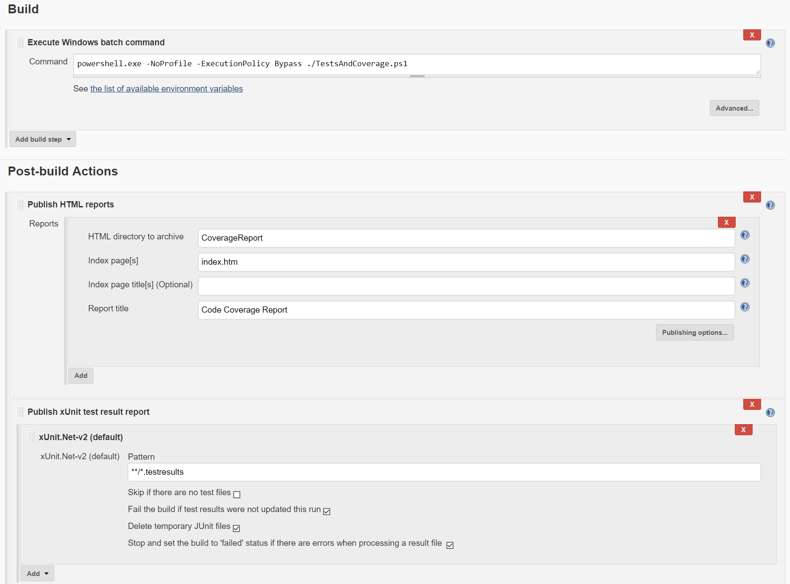

# ReportGeneratorExample

This is a demonstration repository for unit testing and collecting code coverage reports in a .Net Core app with a Jenkins Continuous Integration server.
[ReportGenerator](https://github.com/danielpalme/ReportGenerator) is used along with the [Jenkins HTML Publisher Plugin](https://wiki.jenkins.io/display/JENKINS/HTML+Publisher+Plugin)
to visualize test and coverage results. [A blog post is available with more information.](https://blog.dangl.me/archive/publish-net-core-code-coverage-results-with-reportgenerator-in-jenkins)

## Running tests from the console

The PowerShell script [TestsAndCoverage.ps1](TestsAndCoverage.ps1) executes unit tests with [OpenCover](https://github.com/OpenCover/opencover) attached to collect test results and coverage.

## Jenkins Configuration

